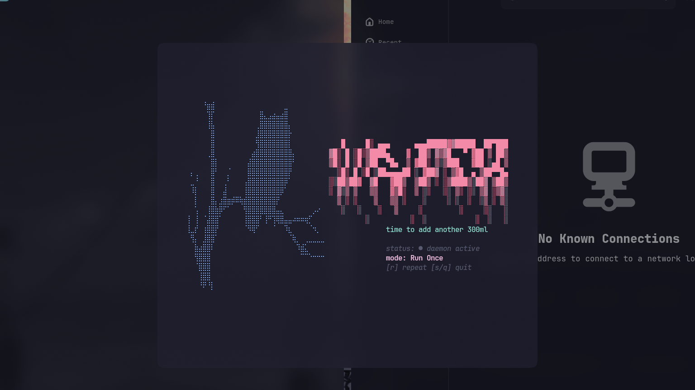

```text
  ████▄   ██░ ██  ██▓ ██▀███   ██▓███
▒██▀ ▀█  ▓██░ ██▒▓██ ▒▓██ ▒ ██▒▓██░  ██▒
▒▓█    ▄ ▒██▀▀██░▒██▒▓██ ░▄█ ▒▓██░ ██▓▒
▒▓▓▄ ▄██▒░▓█ ░██ ░██░▒██▀▀█▄  ▒██▄█▓▒ ▒
▒ ▓███▀ ░░▓█▒░██▓░██░░██▓ ▒██▒▒██▒ ░  ░
░ ░▒ ▒  ░ ▒ ░░▒░▒░▓  ░ ▒▓ ░▒▓░▒▓▒░ ░  ░
  ░  ▒    ▒ ░▒░ ░ ▒ ░  ░▒ ░ ▒░░▒ ░
░         ░  ░░ ░ ▒ ░  ░░   ░ ░░
░ ░       ░  ░  ░ ░     ░
░
```

**chirp** is a lightweight terminal reminder tool. Set a message and an interval, and chirp pops up a small floating window in your terminal to nudge you — to stretch, take a break, drink water, or whatever else you need to remember — right on schedule.

## Showcase



## Features

- 🐣 **Simple dashboard** — a terminal UI for creating, viewing, and managing your reminders ("chirps")
- ⏰ **Background daemon** — runs quietly in the background and checks every few seconds for due reminders
- 🔁 **Auto-repeat** — set a chirp to fire once or keep repeating on its interval
- 🪟 **Floating popups** — when a chirp is due, a small centered popup window pops up on top of everything else
- 💻 **Cross-platform** — native support for Windows and Linux (including Hyprland, GNOME, and KDE window placement)
- 💾 **Local storage only** — reminders are stored in a small JSON file in your OS config directory; nothing leaves your machine

## Installation

### Linux (curl install script)

```bash
curl -fsSL https://raw.githubusercontent.com/stinmark/chirp/main/install.sh | sh
```

This detects your architecture, downloads the latest release binary from [GitHub Releases](https://github.com/stinmark/chirp/releases), and installs it to `/usr/local/bin` (or `~/.local/bin` if that's not writable). To install a specific version instead of the latest:

```bash
CHIRP_VERSION=v0.1.0 curl -fsSL https://raw.githubusercontent.com/stinmark/chirp/main/install.sh | sh
```

### Windows (prebuilt binary)

Download the latest `chirp_windows_amd64.zip` (or `arm64` if you're on an ARM machine) from the [Releases page](https://github.com/stinmark/chirp/releases), extract it, and place `chirp.exe` somewhere on your `PATH`.

### Manual download (any platform)

Grab the archive for your OS/arch from the [Releases page](https://github.com/stinmark/chirp/releases), extract it, and move the `chirp` binary onto your `PATH`.

### Build from source

```bash
git clone https://github.com/stinmark/chirp.git
cd chirp
go build -o chirp .
```

Move the resulting binary somewhere on your `PATH` (e.g. `/usr/local/bin` on Linux, or a folder already in your `PATH` on Windows).

## Usage

Run chirp with no flags to open the interactive dashboard:

```bash
chirp
```

From the dashboard you can create a new chirp (a message + an interval in minutes, with an optional auto-repeat toggle), view your existing chirps, and toggle them active or inactive.

Once you have at least one active chirp, start the background daemon so it can actually fire reminders:

```bash
chirp --run-daemon
```

The daemon forks itself into the background, watches your chirps, and spawns a floating popup window whenever one comes due. It automatically shuts itself down once there are no more active chirps, so you don't need to manage it by hand — just start it again whenever you add a new one.

To stop the daemon manually:

```bash
chirp --stop-daemon
```

### Flags

| Flag                         | Description                                                                   |
| ---------------------------- | ----------------------------------------------------------------------------- |
| `--run-daemon`               | Starts the background scheduler that watches your chirps and triggers popups  |
| `--stop-daemon`              | Stops the currently running background daemon                                 |
| `--ui dashboard`             | Opens the interactive dashboard (also the default with no flags)              |
| `--ui popup --chirp-id <id>` | Opens the floating popup for a specific chirp (used internally by the daemon) |

## How it works

- Reminders ("chirps") are stored as JSON in your OS config directory (e.g. `~/.config/chirp/storage.json` on Linux, `%AppData%\chirp\storage.json` on Windows), with automatic migration from older storage formats.
- The daemon polls this storage every 5 seconds. When a chirp's scheduled time has passed, it spawns a small floating terminal window with your reminder message.
- On Windows, the popup is created as a new console window, centered and brought to the foreground.
- On Linux, chirp detects your desktop environment (Hyprland, GNOME, or KDE) and applies the appropriate rules to center, pin, and focus the popup window; it falls back gracefully on other setups.

## License

See [LICENSE](./LICENSE) for details.
